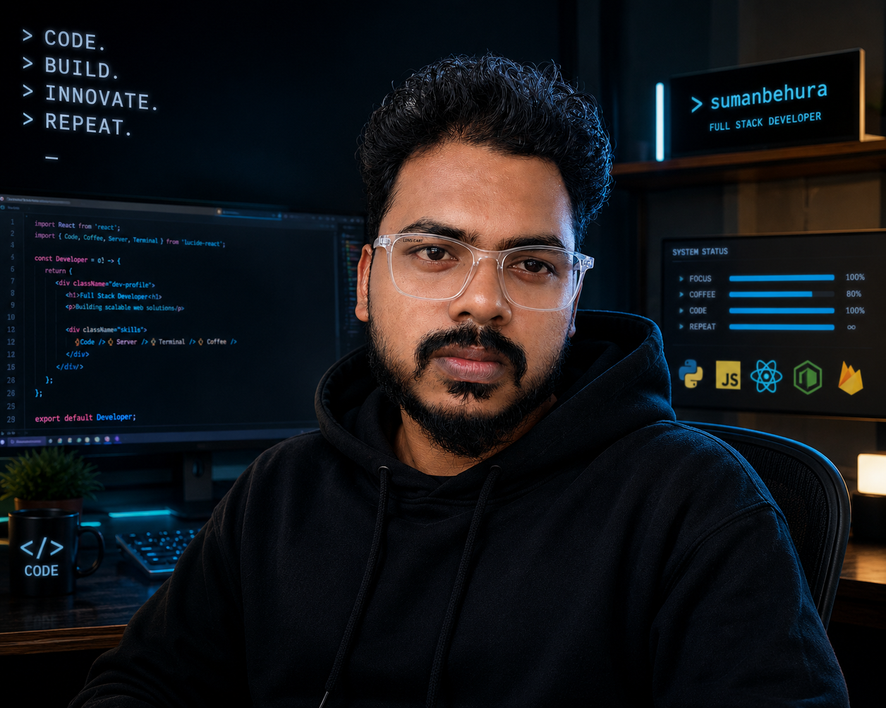

<div align="center">


<a href="https://git.io/typing-svg">
  
</a>

<br/>


<br/><br/>


</div>

<br/>



<br/>


## ⚡ WHO_I_AM.ts

```typescript
const suman = {
  title: "Full Stack Developer",
  stack: {
    languages: ["Python", "SQL", "HTML", "CSS", "JavaScript"],
    frameworks: ["Django", "React"],
  },
  launchedProjects: ["Blackjack_Game", "Lead_Generator"],
  certifications: [],
  status: "🟢 Open to work",
  openTo: ["Full-time roles", "Freelance projects", "Collaborations"],
} as const;

export default suman; // 🚀 building the next big thing
```

<br/>

## 🛰️ FEATURED PROJECTS

<table width="100%">
<tr>
<td width="50%" valign="top">

### 🃏 Blackjack_Game
**Online Casino Game**


| Layer | Technology |
|:--|:--|
| 🎨 Frontend | HTML, CSS, JS |
| ⚙️ Backend | Python |
| 🧠 Logic | Game Engine (Python) |

🔗 [`Code →`](https://github.com/sumanbehura/Blackjack_Game)

</td>
<td width="50%" valign="top">

### 🔗 Lead_Generator
**Chrome Extension for Grabbing Links**


| Layer | Technology |
|:--|:--|
| 🎨 Frontend | JavaScript |
| 🧩 Platform | Chrome Extension API |

🔗 [`Code →`](https://github.com/sumanbehura/Lead_Generator)

</td>
</tr>
</table>

<br/>


## 🧬 TECH STACK

<div align="center">

**Languages**


<br/>

**Frontend**


<br/>

**Backend / Infra**


</div>

<br/>


## 📡 GITHUB STATS

<div align="center">


<br/>


</div>

<br/>

## 🏆 TROPHIES

<div align="center">

</div>

<br/>

## 📈 CONTRIBUTION ACTIVITY

<div align="center">

</div>

<br/>


## 🌐 CONNECT

<div align="center">

<a href="https://www.linkedin.com/in/suman-behura-7a11a2246/">
  
</a>

</div>

<br/>


<div align="center">
<i>⚡ Thanks for stopping by — let's build something futuristic together. ⚡</i>
</div>
